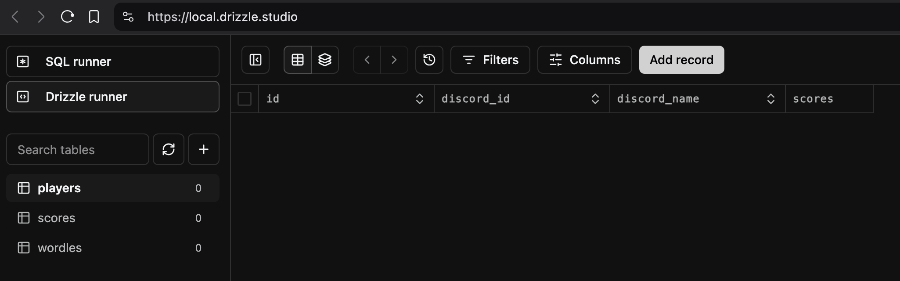

# Discord Wordle Bot - Template
A template for creating a Discord Wordle bot of your own. You can either fork this repo to use as-is or create your own by following the step-by-step instructions below.

## Setup
- Install bun: `npm i -g bun`
- Initialize the project with bun: `bun init`
  - Accept defaults when prompted
- Create `src` folder: `mkdir src`
- Move the `index.ts` file into the `src` folder
- Test everything out by running `bun run src/index.ts`
  - You should see output in your terminal `Hello via Bun!`

## Discord Wordle Bot

### Discord App Setup
Next we need to set up connecting to Discord to listen for messages in a channel. In order to do that we need to create an app via the Discord Developer portal.

- Go to the [Discord Developer Portal](https://discord.com/developers/applications) and sign into your Discord account
- Click "New Application", give your app a name (like "My Wordle Bot") and choose "Personal" for your team
- Click on "Installation" from the side menu
- Under "Installation Contexts" uncheck "User Install"
- Under "Default Install Settings" and "Guild Install" click on the dropdown menu for "Scopes" and select "bot"
- A new field will display called "Permissions", click on the dropdown menu and select the following:
  - View Channels
  - Read Message History
  - Send Messages
- Click on "Save Changes"
- Click on "Bot" from the side menu
- Scroll down to "Message Content Intent" and toggle that to on/enabled so it shows as green. Then click "Save Changes"
- Scroll back up and click "Reset Token" then "Yes, do it!"
- A new token value will be displayed. Copy and save it somewhere safe.

### Discord Connection Code
- In your terminal run `bun add discord.js`
- Create a file called `.env` in the root directory of your project
- Edit the `.env` file to have a key of `DISCORD_BOT_TOKEN=` and set its value to your Discord token you saved in the previous section
  - Example: `DISCORD_BOT_TOKEN=xyzabc123`
- Open the `index.ts` file you created earlier in the `src` folder
- Add the following code to it:
  ```typescript
  import { Client, Events, GatewayIntentBits } from 'discord.js';

  const client = new Client({
    intents: [
      GatewayIntentBits.Guilds,
      GatewayIntentBits.GuildMessages,
      GatewayIntentBits.MessageContent,
    ],
  });

  client.once(Events.ClientReady, async (readyClient) => {
    console.log(`Logged in as ${readyClient.user?.tag}`);
  });

  client.on(Events.MessageCreate, async (message) => {
    console.log(`${message.author.tag} said ${message.content}`);
  });

  await client.login(process.env.DISCORD_BOT_TOKEN);
  ```
- Save your changes and open your terminal
- Test the connection to Discord works by running `bun run src/index.ts`
  - You should see a message like `"Logged in as My Wordle Bot #1234"`
- Leave the bot running for now

### Discord Server Bot Install
It's recommended to have a separate, private, server to use for testing before using the actual server you want to run the bot in.

- Go back to the [Discord Developer Portal](https://discord.com/developers/applications) (sign back into your Discord account if you signed out from earlier)
- Select your bot and choose "Installation" from the side menu
- Scroll down to "Install Link"
- You should see a field with a URL in it. Click the "Copy" button.
  - Example: `https://discord.com/oauth2/authorize?client_id=11111`
- Open your browser and paste the URL you copied into the address field
- Select which server you want to add the bot to. Then click "Continue"
- Make sure "View Channels", "Send Messages" and "Read Message History" are all checked. Then click "Authorize"
- You should see a "Success!" message. Go to the Discord server you added the bot to and double check it has joined the server.

### Testing the Bot Reads Messages

- Depending on your server set up you may need to explicitly give your bot permissions to read and send messages in the channel(s) you intend to use it.
- Go to a channel your bot has permissions in and send a message.
- Go back to your terminal from earlier where the bot should still be running and you should see a log message showing you sent that message
  - Example: `"clarkio said test"`
  - If you don't see anything like that logged, make sure it's running from before. `bun run src/index.ts`
- You just finished creating your Discord Bot!

### Wordle Parsing
Now that you have a Discord bot that connects and listens for messages you need to handle finding and parsing messages that contain Wordle results.

- Open `index.ts` in the `src` folder.
- Add this `const` as a regular expression to check if a message is a Wordle result `const wordlePattern = /Wordle (\d{0,3}(,?)\d{1,3}) (🎉 ?)?([X1-6])\/6/;`
- After that add:
  ```ts
  type WordleResult = {
    discordId: string;
    userName: string;
    gameNumber: number;
    attempts: string;
  };
  ```
- Then add `let wordleResults: WordleResult[] = [];`
- Add the following function at the end of the file:
  ```ts
  function parseWordleResult(message: any): WordleResult | undefined {
    const userName = message.author.username;
    const discordId = message.author.id;
    const match = wordlePattern.exec(message.content);

    if (match) {
      const gameNumber = parseInt(match[1].replace(/,/g, ''));
      const attempts = match[4];

      return {
        discordId,
        userName,
        gameNumber,
        attempts,
      };
    }

    return undefined;
  }
  ```
- Inside the `client.on(Events.MessageCreate...` callback function remove the `console.log` code from before.
- Add the following code in its place:
  ```ts
  const parsedWordle = parseWordleResult(message);
  if (parsedWordle) {
    const currentResults = await processLatestWordleResult(parsedWordle);
    await processCurrentResults(currentResults, message);
  } else {
    console.log('Message was determined to not be intended for the bot');
  }
  ```
- Now you need to implement the `processLatestWordleResult` and `processCurrentResults` functions. At the bottom of `index.ts` add the following code for them:
  ```ts
  async function processLatestWordleResult(parsedWordle: WordleResult): Promise<WordleResult[]> {
    // Prevent duplicates
    const existingResultForUser = wordleResults.find((wordle) => wordle.discordId === parsedWordle.discordId && wordle.gameNumber === parsedWordle.gameNumber);
  
    const scoresForCurrentGame = wordleResults.filter((wordle) => wordle.gameNumber === parsedWordle.gameNumber) || [];
  
    if (!existingResultForUser) {
      wordleResults.push(parsedWordle);
      scoresForCurrentGame.push(parsedWordle);
    } else {
      console.log(`Result already exists: ${parsedWordle.gameNumber} - ${parsedWordle.userName}`);
    }
  
    return scoresForCurrentGame;
  }
  ```

### Sharing Wordles
Now you can start trying out sharing your Wordle results in the text channel this bot is listening to.

- First try sending a general message to make sure it ignores it and doesn't try to parse it as a wordle
  - Example: `'Hello world'`
- You should see the following message logged: `"Message was determined to not be intended for the bot"`
- Then try a real Wordle
  - Example:
    ```
    Wordle 1,265 5/6

    ⬛⬛⬛⬛⬛
    ⬛⬛🟨🟨⬛
    ⬛🟨⬛⬛🟨
    🟩🟩⬛🟩⬛
    🟩🟩🟩🟩🟩
    ```
- You should see something like the following message logged: `"Current Winner for Wordle 1,265 with 5 attempts: <@1234567890>"`
- You should also see a message in the Discord channel from your bot indicating the current winner for the Wordle you entered
  - Example:

    
- Sweet! Now you have a working Discord bot that can parse and process messages containing Wordle results AND it responds with who's winning with the lowest number of attempts for that Wordle game number.

## Data Storage
Currently you're only storing the Wordle results in memory via the `wordleResults` array. If you stop the bot or it restarts you'll lose any of the previously captured results. Let's make the bot more robust by using a database for storage.

### Database Setup
You can use any database technology you'd like to handle storage for your bot but for this tutorial you'll learn how to use libSQL (SQLite compatability) with DrizzleORM (Object-Relational Mapping).

- In your terminal run: `bun add @libsql/client drizzle-orm`
- In your terminal run: `bun add -d drizzle-kit`
- Create a new file in the root of the project named `local.db`
- Open the `.env` file and add a key `DB_FILE_NAME` with a value of `local.db`
  - Example: `DB_FILE_NAME=file:local.db`
- Create a folder `db` in the `src` folder
- Inside the `db` folder create a new file `index.ts`
- Add the following code to the contents of `index.ts`:
    ```ts
    import { drizzle } from 'drizzle-orm/libsql';
    import { createClient } from "@libsql/client";
    import { playersTable, scoresTable, wordlesTable } from './schema';
    import * as schema from './schema';

    const client = createClient({
      url: process.env.DB_FILE_NAME!,
    });
    const db = drizzle(client, {schema});
    ```
- Inside the `db` folder create a new file `schema.ts`
- Add the following code to the contents of `schema.ts`:
    ```ts
    import { relations } from "drizzle-orm";
    import { integer, sqliteTable, text, primaryKey } from 'drizzle-orm/sqlite-core';

    export const wordlesTable = sqliteTable('wordles', {
      id: integer('id').primaryKey({ autoIncrement: true }),
      gameNumber: integer('game_number').notNull().unique(),
    });

    export const playersTable = sqliteTable('players', {
      id: integer('id').primaryKey({ autoIncrement: true }),
      discordId: text('discord_id').notNull().unique(),
      discordName: text('discord_name').notNull(),
    });

    export const scoresTable = sqliteTable('scores', {
      discordId: text('discord_id').notNull().references(() => playersTable.discordId),
      gameNumber: integer('game_number').notNull().references(() => wordlesTable.gameNumber),
      attempts: text('attempts').notNull(),
      isWin: integer('is_win').default(0),
      isTie: integer('is_tie').default(0),
    }, (table) => ({
      pk: primaryKey({ columns: [table.discordId, table.gameNumber] })
    }));

    export const playerScoresRelations = relations(playersTable, ({ many }) => ({
      scores: many(scoresTable)
    }));

    export const scoresRelations = relations(scoresTable, ({ one }) => ({
      player: one(playersTable, {
        fields: [scoresTable.discordId],
        references: [playersTable.discordId]
      }),
      wordle: one(wordlesTable, {
        fields: [scoresTable.gameNumber],
        references: [wordlesTable.gameNumber]
      })
    }));

    export const wordleRelations = relations(wordlesTable, ({ many }) => ({
      scores: many(scoresTable)
    }));

    export type InsertWordle = typeof wordlesTable.$inferInsert;
    export type SelectWordle = typeof wordlesTable.$inferSelect;

    export type InsertPlayer = typeof playersTable.$inferInsert;
    export type SelectPlayer = typeof playersTable.$inferSelect;

    export type InsertScore = typeof scoresTable.$inferInsert;
    export type SelectScore = typeof scoresTable.$inferSelect;
    export type SelectScoreWithRelations = SelectScore & { player: SelectPlayer };
    ```
- In the root of the project add a new file `drizzle.config.ts`
- Add the following to the contents of `drizzle.config.ts`
  ```ts
  import { defineConfig } from 'drizzle-kit';

  export default defineConfig({
    out: './drizzle',
    schema: './src/db/schema.ts',
    dialect: 'sqlite',
    dbCredentials: {
      url: process.env.DB_FILE_NAME!,
    },
  });
  ```
- In your terminal run `npx drizzle-kit push`
- Once that finishes you can double check everything is all set by running `npx drizzle-kit studio` and then opening your browser to [https://local.drizzle.studio](https://local.drizzle.studio)
  - Example:
    

### Save Wordle Results
With all of that set up, now it's time for you to save the parsed Wordle results shared in your Discord to your database.

- Open up the file `index.ts` in the `src` folder.
- First we'll need new imports. Add the following to the top of the file:
  ```ts
  import * as db from './db';
  import type { SelectScoreWithRelations } from './db/schema';
  ```
- Go to where you initialize the `wordleResults` array and remove it. Search for this `let wordleResults: WordleResult[] = [];` to find it quickly (likely around line 19)
- Go to the function `processLatestWordleResult`
- Replace the `processLatestWordleResult` function with the following:
  ```ts
  async function processLatestWordleResult(parsedWordle: WordleResult): Promise<SelectScoreWithRelations[]> {
    // Prevent duplicates
    const scoresForCurrentGame = await db.getScoresByGameNumber(parsedWordle.gameNumber);
    const existingResultForUser = scoresForCurrentGame.find((score: SelectScoreWithRelations) => score.discordId === parsedWordle.discordId);
    if (!existingResultForUser) {
      await db.createPlayer(parsedWordle.discordId, parsedWordle.userName);
      if(scoresForCurrentGame.length === 0) {
        await db.createWordle(parsedWordle.gameNumber);
      }
      const addedScore = await db.createScore(parsedWordle.discordId, parsedWordle.gameNumber, parsedWordle.attempts);
      if(addedScore){
        scoresForCurrentGame.push(addedScore);
      } else {
        console.error(`Error adding result to the database: ${parsedWordle.gameNumber} - ${parsedWordle.userName}`);
      }
    } else {
      console.log(`Result already exists: ${parsedWordle.gameNumber} - ${parsedWordle.userName}`);
    }
    return scoresForCurrentGame;
  }
  ```
  - Go to the `processCurrentResults` function and update the `currentResults` parameter type to `SelectScoreWithRelations[]`. Example: `async function processCurrentResults(currentResults: SelectScoreWithRelations[], message: any)`
  - Do the same for the `winners` variable inside the `processCurrentResults` function so that it's type is `SelectScoreWithRelations[]`. Example: `const winners: SelectScoreWithRelations[] = await determineWinners(currentResults);`
  - Similarly go to the `determineWinners` function and change the `results` parameter type to `SelectScoreWithRelations[]` as well as the return type within the `Promise<SelectScoreWithRelations[]>`. Example: `async function determineWinners(results: SelectScoreWithRelations[]): Promise<SelectScoreWithRelations[]>`
  - For the last update to the `index.ts` file go to the `informLatestResults` function and update the `winners` parameter type to `SelectScoreWithRelations[]`. Example: `async function informLatestResults(winners: SelectScoreWithRelations[], message: any)`
  - Save your changes
  - Next open the `index.ts` file in the `db` folder.
  - Replace the entire contents of the file with the following code:
    ```ts
    import { drizzle } from 'drizzle-orm/libsql';
    import { createClient } from "@libsql/client";
    import { eq, and } from "drizzle-orm";
    import { playersTable, scoresTable, wordlesTable, type SelectScoreWithRelations } from './schema';
    import * as schema from './schema';

    const client = createClient({
      url: process.env.DB_FILE_NAME!,
    });
    const db = drizzle(client, { schema });

    export async function getScoresByGameNumber(gameNumber: number): Promise<SelectScoreWithRelations[]> {
      try {
        return await db.query.scoresTable.findMany({
          where: eq(scoresTable.gameNumber, gameNumber), with: {
            player: true
          }
        });
      } catch (error) {
        console.error(error);
        return [];
      }
    }

    export async function createWordle(gameNumber: number): Promise<boolean> {
      try {
        await db.insert(wordlesTable).values({ gameNumber }).onConflictDoNothing();
        return true;
      } catch (error) {
        console.error(error);
        return false;
      }
    }

    export async function createPlayer(discordId: string, discordName: string): Promise<boolean> {
      try {
        await db.insert(playersTable).values({ discordId, discordName }).onConflictDoNothing();
        return true;
      } catch (error) {
        console.error(error);
        return false;
      }
    }

    export async function createScore(discordId: string, gameNumber: number, attempts: string, isWin: number = 0, isTie: number = 0): Promise<SelectScoreWithRelations | undefined> {
      try {
        const result = await db.insert(scoresTable).values({ discordId, gameNumber, attempts, isWin, isTie }).onConflictDoNothing().returning();
        if (result.length === 0) {
          return undefined;
        }
        const score = await db.query.scoresTable.findFirst({
          where: and(eq(scoresTable.gameNumber, gameNumber), eq(scoresTable.discordId, discordId)), with: {
            player: true
          }
        });
        return score;
      } catch (error) {
        console.error(error);
        return;
      }
    }
    ```
    - Open up your terminal and run `bunx drizzle-kit studio`
    - Open your browser to [https://local.drizzle.studio](https://local.drizzle.studio) to see a UI for the data in your database.
    - Open up a new terminal window and run `bun run src/index.ts`
    - Go to your Discord server where you added your bot and share a wordle result as a message. You can use the example one from the "Sharing Wordles" section earlier.
    - Go back to your browser with the UI for the database and refresh the page to see if the Wordle result you shared in Discord was saved successfully.
    - Congrats you've completed this section and have a persistent Discord Wordle Bot working!

## Deploying
Now that you have everything working you'll realize the bot only runs when you start it up on your machine. What if you want it to run all the time? You need to deploy it somewhere that can host the bot for you. You have *a lot* of options (both free and paid) when it comes to hosting so if you already have a provider you like to use then go with that.

- TODO
